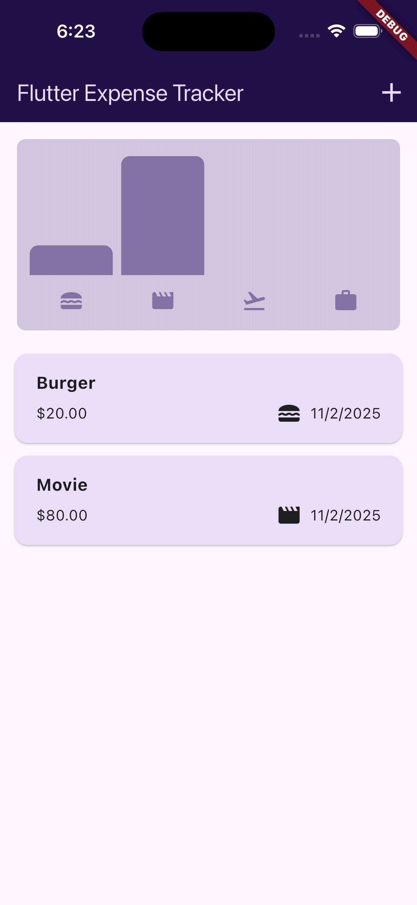
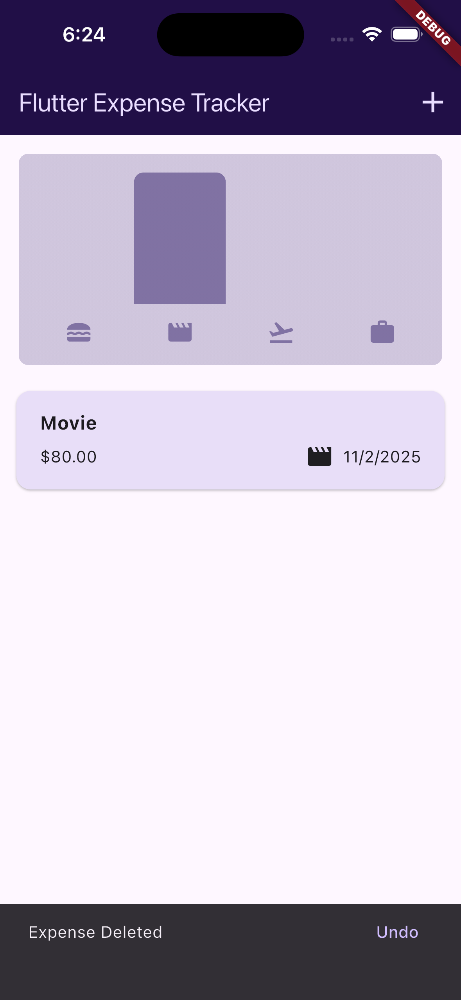
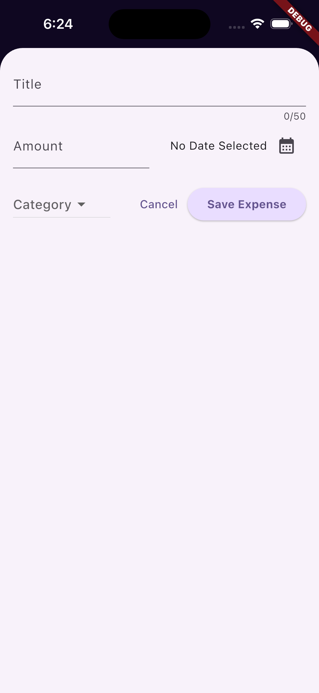
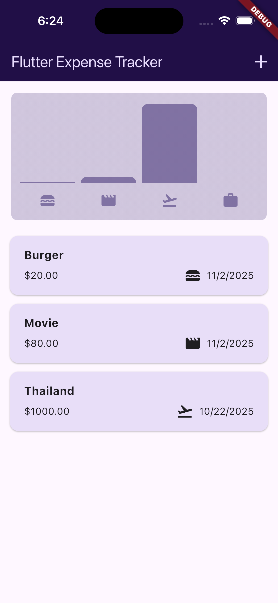
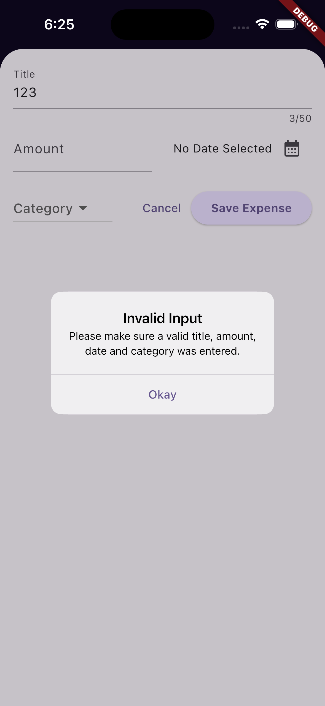

💸 Flutter Expense Tracker App

A simple yet elegant Expense Tracker App built using Flutter, designed to help users manage their daily expenses efficiently. The app allows users to add, view, and delete expenses with category-wise charts, and supports both light and dark modes with a responsive UI for mobile and landscape screens.

---

## 📱 App Overview

The Tour Booking App allows users to:

- 💰 Expense Tracking: Add, view, and manage daily expenses easily.
- 🗂️ Category Grouping: Expenses are automatically grouped by category (Food, Travel, Leisure, Work).
- 📊 Visual Insights: Bar chart shows category-wise spending distribution.
- 🌗 Light & Dark Themes: Adaptive color schemes for better viewing experience.
- 📱 Responsive Layout: Works seamlessly in both portrait and landscape modes.
- 🔄 Undo Deletions: Restore accidentally deleted expenses with one tap.
- 🧭 Platform Adaptation: Uses Cupertino (iOS) or Material (Android) dialogs automatically.
- 🧩 Clean Code Architecture: Follows Flutter best practices with reusable widgets and state management.
- 🎨 Modern UI: Minimal and intuitive design using Material 3 styling.

## 🚀 Features

- 🧾 Add new expenses with title, amount, category, and date
- 🗑 Delete expenses with Undo option via Snackbar
- 📊 Visualize your spending habits with an animated chart view
- 🌙 Supports dark mode and adaptive themes
- 📱 Responsive layout for portrait and landscape orientations
- 🧭 Platform-adaptive dialogs — uses Cupertino dialogs on iOS and Material dialogs on Android

---

## 🛠️ Tech Stack

- **Framework**: Flutter 3.19+
- **Language**: Dart 3.0+
- **UI**: Material Design 3

---

## 🏃‍♂️ Getting Started

### Prerequisites

- Flutter SDK 3.19.0 or later
- Dart 3.0 or later
- iOS/Android simulator or physical device

### Installation

1. Clone the repository:

   ```bash
   git clone https://github.com/ItsMonkeyDLuffy/ExpenseTracker.git

   ```

2. Navigate into the project directory:

   ```bash
   cd fourthapp

   ```

3. Install dependencies:

   ```bash
   flutter pub get

   ```

4. Start Flutter app:
   ```bash
    flutter run
   ```

---

## 📸 Screenshots

<p float="left">

  
  
  
  
  
  

</p>
